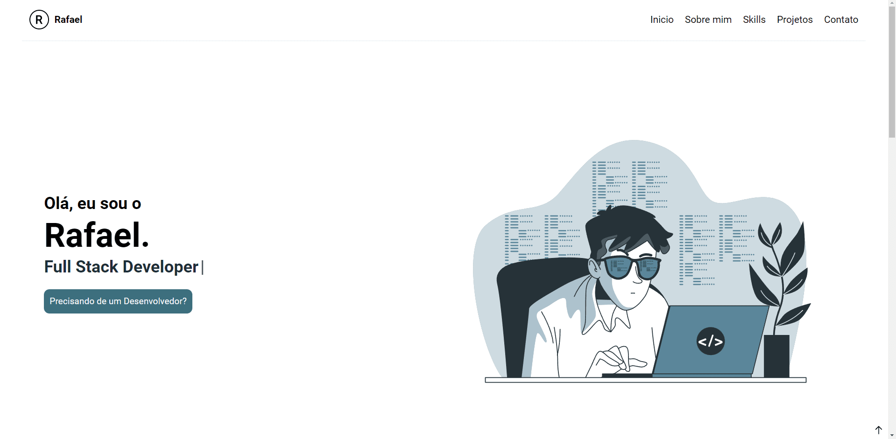
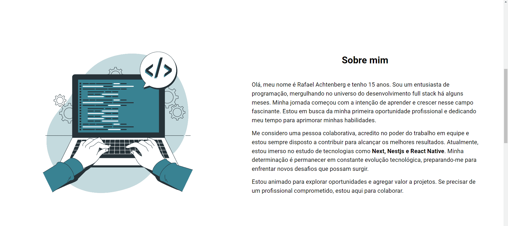

# My Portifolio

Bem-vindo ao meu portfólio pessoal, uma aplicação web desenvolvida com as seguintes tecnologias React, TypeScript e Vite. Este projeto é uma representação digital das minhas habilidades, projetos e experiências profissionais.

## Layout Web

## Layout Mobile

  <!-- Linha vazia para criar um espaçamento -->

## 🛠️ Tecnologias

💻 **Front-end**

- [React](https://react.dev/): O uso de React foi devido à sua ampla popularidade, flexibilidade notável, capacidade de reutilização de componentes e aproveitamento eficaz de hooks. Essas características convergem para uma eficiência notável na construção de interfaces de usuário interativas.
- [Typescript](https://www.typescriptlang.org): TypeScript para tipagem do código, proporcionando não apenas uma manutenção mais simplificada, mas também prevenindo potenciais erros e elevando a legibilidade do código.
- [Vite](https://vitejs.dev/): Usei esse bundler pelos beneficios devido à sua rapidez no desenvolvimento e build, proporcionando uma experiência de desenvolvimento mais eficiente.

📚 **Bibliotecas**

- [clsx](https://www.npmjs.com/package/clsx): Usei clsx estilização em conjunto com o tailwind, possibilitando melhor estilização e controle de classes, e uso de condições.
- [react-typing-effect](https://www.npmjs.com/package/react-typing-effect): Essa biblioteca consegue realizar criação de efeitos de digitação em tempo real, assim melhorando a experiência do usuario, deixando a mesma mais interativa.
- [@emailjs/browser](https://www.emailjs.com/docs/sdk/installation/): Utilizei essa biblioteca por causa de seus simples jeito de usar e a facilidade no envio de e-mails na aplicação.
- [react-hook-form](https://react-hook-form.com/): O react-hook-form, foi escolhido por conta de sua criação e validação de formularios, ajudando muito no gerenciamento de dados do formulario.
- [react-hot-toast](https://react-hot-toast.com/), Essa biblioteca foi usada para exibir notificações durante interações importantes que o usuario pode fazer, assim deixando uma melhor interação e compreensão do que esta acontecendo no site.
- [radix-ui](https://www.radix-ui.com/) o radix-ui esta sendo usado por conta de uma melhor estilização e estrutura, possibilitando um padrão de icons no site, e tambem a facilidade de utilizar "componentes pré-prontos".
- [zustand](https://zustand-demo.pmnd.rs/) zustand foi muito util nessa aplicação para controle de estados complexos.
- [zod](https://zod.dev/), utilizei o zod por conta de conseguir validar dados de uma forma facil e consistente,assim conseguindo fazer melhor manipulação dos dados que estão sendo validados.

🎨 **Estilização**

- [tailwindcss](https://tailwindcss.com/docs/installation): Utilizei tailwind por conta de facilidade em estilizar podendo utilizar estilização inline, alem de claro poder customizar novos estilos.

🔋 **Versionamento e Deploy**

- [Git](https://git-scm.com) Utilizei Git para controle de versionamento, o que facilita o trabalho colaborativo e o acompanhamento das alterações no código.

- [Vercel](https://vercel.com/) A escolha da Vercel para deploy foi feita devido à sua integração fácil com repositórios Git e sua eficiência no deployment de aplicações front-end.

⚙️ **Configuranções e Instalações**

Clone do Projeto

    $ git clone https://github.com/Faelkk/my-portfolio

Instalando as dependências

    $ npm install

Iniciando o projeto

    $ npm run dev

 

**Como me ajudar nesse projeto?**

- Você ira me ajudar muito me seguindo aqui no GitHub
- Dando uma estrela no projeto
- Conectando-se comigo no LinkedIn para fazer parte da minha rede.

 

**Feito por**
[Rafael Achtenberg](linkedin.com/in/rafael-achtenberg-7a4b12284/)
